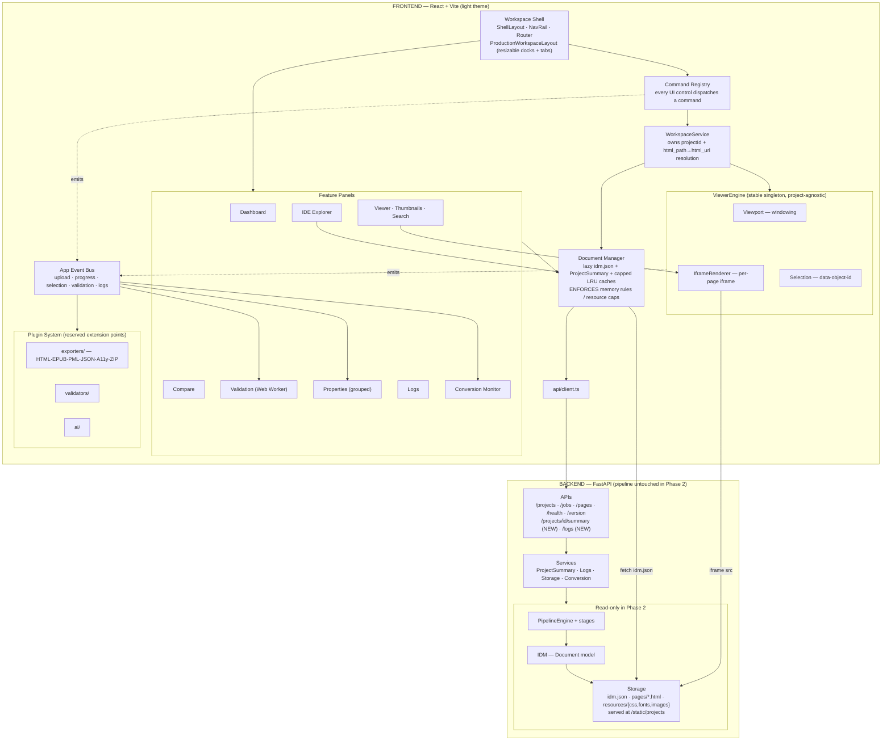

# LayoutForge — Architecture

This document is the stable, infrequently-changing overview of the system.
For the day-to-day execution checklist, see `docs/PHASE2_IMPLEMENTATION.md`.
For product phase history, see `CHANGELOG.md`.

## Product roadmap

- **Phase 1 — Conversion Engine** ✅ (PDF upload → pipeline → IDM → HTML/CSS → basic viewer)
- **Phase 2 — Production Publishing Workspace** ← current
- **Phase 2.5 — Performance & Scale** (large-PDF hardening; reserved, not yet built)
- **Phase 3 — Visual Editing Engine** (reserved)
- **Phase 4 — EPUB Production Platform** (reserved)

## Phase 2 Architecture Diagram

## Major components

### Workspace Shell (`frontend/src/layout/`)
`ShellLayout` — a left icon+label **NavRail** (global: Dashboard, Projects,
Conversion, Settings; contextual, shown when a project is open: Viewer,
Compare, Validation, Logs) plus a router `<Outlet/>`. `ProductionWorkspaceLayout`
nests `react-resizable-panels`: an outer vertical group (main row over a bottom
dock) wrapping an inner horizontal group (Explorer | center tab strip |
Properties). Panel sizes persist via `autoSaveId`. One workspace, many docked
panels/tabs — not many separate page destinations.

### Command Registry (`frontend/src/commands/`)
Every UI control (button, menu, future command palette, future keybinding)
**dispatches a command** rather than calling the ViewerEngine or a component
directly. `Command = { id, title, group, run(ctx), enabled?(ctx), keybinding?
}`, where `ctx.workspace` is a `WorkspaceService` (see below) — commands never
receive the ViewerEngine directly. Today's commands wrap
`WorkspaceService` calls (`navigate.*`, `zoom.*`) plus reserved, guarded
`view.*` / `export.*` / `validate.*` commands. This is the seam that will
power move/resize/delete/undo/redo and the command palette in Phase 3 without
touching call sites.

### WorkspaceService (`frontend/src/workspace/WorkspaceService.ts`)
The seam between Commands/UI and the ViewerEngine, and the layer that owns
everything the engine must not know: which project is currently open, and how
a page's storage-relative `html_path` resolves into a fetchable `html_url`.
`WorkspaceService.openProject(projectId, pages: PageRead[])` does that
resolution and calls `engine.openDocument(resolvedPages)`; navigation/zoom
methods are thin pass-throughs today, but this is also where future
document-aware commands (export, validate, delete-page) attach without
teaching the ViewerEngine about projects. One instance, wrapping the single
ViewerEngine singleton, provided via `WorkspaceServiceContext`.

### WorkspacePanel contract (`frontend/src/workspace/WorkspacePanel.ts`)
A `WorkspacePanelDescriptor = { id, title, icon?, activate?, deactivate?,
dispose?, commands?() }` interface every dockable panel (Explorer, Viewer,
Compare, Validation, Properties, Logs, and future panels like 2B's Page Cache
Debug panel) describes itself with. Panels that are *switched* — today, the
CenterDock's Viewer/Compare/Validation tabs — get real `activate`/`deactivate`
calls when they become/stop being the visible tab (see `CenterDock.tsx`).
Panels that are *always-on* docks (Explorer, Properties, the bottom Logs dock)
satisfy the contract trivially via their own React mount/unmount — no
artificial boilerplate is added where there's nothing to activate/deactivate.

### App Event Bus (`frontend/src/context/EventBusContext.tsx`)
An app-wide promotion of the existing viewer `EventBus` pattern so
**upload → pipeline-progress → workspace → viewer → selection → validation →
properties → plugins → logs** all communicate via typed pub/sub, not direct
references. This is what lets plugins/exporters/validators be added without
touching existing call sites. The backend has an analogous `EventDispatcher`
(`backend/app/events/`).

### Document Manager (`frontend/src/document/DocumentManager.ts`)
The single frontend owner of a project's document data and **the enforcement
point for the memory rules** (see Large Document Architecture below): lazily
fetches/slices `idm.json`, holds capped LRU caches (IDM slices, thumbnails,
incremental search index, validation results, **`ProjectSummary` — statistics/
manifest/health/warnings, its own small cache**), and feeds the ViewerEngine
(via WorkspaceService), Explorer, Properties, Validation, and Search panels.
No other module parses the whole IDM, and no other module calls
`getProjectSummary` from `api/client.ts` directly — every consumer (e.g. the
Explorer's `ProjectTree`) asks the Document Manager for just the page/object/
summary it needs.

### ViewerEngine (`frontend/src/viewer/`)
A framework-agnostic class, held as a **stable singleton** across route
changes (never recreated on render — that would remount every iframe).
Deliberately **project-agnostic**: its `ViewerPage` shape carries only page
geometry and a fully-resolved `html_url` — no project id, no relative storage
path, no Job/Manifest/Statistics concepts. `openDocument(pages: ViewerPage[])`
(not `openProject`) is the entry point; resolving *which* project's pages to
open and turning `html_path` into `html_url` is the WorkspaceService's job.
- `Viewport` — pure windowing math (which page numbers should be mounted).
- `IframeRenderer` — renders one page via a same-origin `<iframe>` pointing at
  the backend-served, self-contained HTML (`/static/projects/{id}/pages/
  page_XXXX.html`) — the URL is resolved upstream by WorkspaceService and
  handed to the engine as `page.html_url`. This is the verified golden
  rendering path — untouched by Phase 2 UI work. Never resize the iframe on
  zoom/rotate; transform the wrapper only.
- `Selection` — click-to-select via `data-object-id`, the same identity/
  selection pipeline that will power editing in Phase 3.
- `NavigationManager` / `ZoomManager` — page navigation and zoom state.
- The `mountPage` generation-guard defends against React StrictMode's
  double-invoked effects appending duplicate iframes.

### Feature Panels (`frontend/src/features/`)
Dashboard, IDE-style Project Explorer, Viewer (+ thumbnails + search),
Compare, Validation (runs in a Web Worker), Properties (grouped: Geometry /
Typography / Appearance / Metadata / Advanced — confidence is intentionally
never fabricated), Logs, Conversion Monitor.

### Plugin System (reserved, `frontend/src/plugins/`)
`exporters/`, `validators/`, `ai/` — empty extension points in Phase 2, sized
so Phase 4 (EPUB export) and future accessibility/AI modules drop in without
reorganizing the project.

### Backend APIs (`backend/app/api/`)
Existing: `/api/health`, `/api/version`, `/api/projects`, `/api/projects/{id}`,
`/api/jobs/{id}`, `/api/projects/{id}/pages`, static mount
`/static/projects/{id}/...`.
New in Phase 2 (read-only, no pipeline changes): `GET /api/projects/{id}/summary`
(consolidated project + statistics + manifest + health + progress + warnings +
recent-logs snippet) and `GET /api/logs?stream=...&tail=N` (fixed
application/conversion/performance allow-list).

### IDM (`backend/app/pipeline/document.py`, `backend/app/pipeline/elements/`)
The Internal Document Model — the single source of truth between extraction
and output generation. Persisted per project as `storage/projects/{id}/
idm.json` and served statically. Every element (`TextBlock`, `ImageElement`,
`ShapeElement`) carries a stable `id` used as `data-object-id` in generated
HTML — this is the identity Selection and the future editor both rely on.

### Storage (`backend/app/services/storage_service.py`)
Owns the on-disk project workspace layout: `source.pdf`, `idm.json`,
`pages/*.html`, `resources/{css,fonts,images}/`. Read-only from the frontend's
perspective in Phase 2; served via the static mount.

## Large Document Architecture (NON-NEGOTIABLE)

The application must handle extremely large/complex PDFs **without
architectural changes** — a first-class requirement, not a viewer feature.

**Target scale:** files 5 MB → 50 MB → 250 MB → 1 GB (future); 10 → 100 → 500 →
2,000+ pages; 100k text spans, 50k images, thousands of fonts, thousands of
vector objects.

**Memory rules (enforced in Phase 2):**
- Never hold the entire document in React state.
- Viewer renders only the active window; pages mount/unmount automatically.
- `idm.json` is loaded lazily and consumed incrementally — never parsed
  wholesale into component state (this is the Document Manager's job).
- Images and thumbnails lazy-load (plain `` for thumbs —
  no iframes).
- Search index is built incrementally (chunked, background).
- Properties panel loads only the selected object.
- Validation runs page-by-page, incrementally, off the main thread.

**Resource caps:** hard limits + LRU eviction on mounted iframes (~9), decoded
thumbnails, cached page records, cached fonts.

**Performance budgets** (verified under Phase 2.5 stress tests): workspace
startup < 2 s · open project < 500 ms · page navigation < 50 ms · zoom < 16 ms
· selection < 10 ms · property update < 5 ms.

**Phase 2 vs 2.5 boundary:** Phase 2's frontend is *built to consume*
progressive availability and obeys the memory rules above within today's
constraints. True end-to-end streaming, independently restartable/checkpointed
pipeline stages, and real background workers (Celery/RQ/RabbitMQ/K8s — the
`PipelineEngine` is already backend-agnostic to allow this) are **Phase 2.5**,
because they require touching the backend pipeline, which Phase 2 must not do.

**Production-First benchmark corpus:** every feature must work on real
publishing documents — children's books, textbooks, magazines, scientific
PDFs, comics, fixed-layout EPUBs, RTL & CJK & mixed scripts, embedded fonts,
rotated pages, vector graphics, transparency, large image assets, tables,
multi-column layouts. This corpus is the benchmark for design decisions and
the Phase 2.5 regression suite.

## Future-editing principle

Every object already carries a stable IDM `object_id` and flows through one
`Selection` pipeline. The same id + pipeline will power editing in Phase 3 —
no parallel identity or selection mechanism should ever be introduced.

## Constraints that apply to all future work in Phase 2

- Do not touch the backend pipeline, extraction stages, HTML/CSS generators,
  or `IframeRenderer`'s rendering core. New backend reads are derived from
  already-persisted artifacts (`idm.json`, DB, filesystem).
- Never resize the iframe on zoom/rotate — transform the wrapper.
- Preserve the `mountPage` StrictMode generation guard.
- UI controls dispatch commands; cross-module communication goes through the
  event bus.
- The logs endpoint only accepts a fixed stream allow-list, never arbitrary
  paths.
